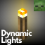

<h1 align="center">
   
  Dynamic Lights
</h1>

  
  
  
  

> A server-side data pack/mod for Minecraft 1.17x-1.21x

YouTube showcase

## Features

Supported entities and items such as torches or lanterns will emit light by using the light block added in 21w13a. Because of this, the dynamic lights are limited to the block grid. (see [#9](https://github.com/Tschipcraft/dynamiclights/issues/9) for more information)

Some items are water sensitive and only turn off or on inside water. Additionally, all enchanted items will emit light level 6 while some enchants under certain conditions emit light level 9.
For a detailed overview of all supported items and entities, take a look at the wiki pages linked below.

Since this project is completely server-side, players joining a server with Dynamic Lights installed will not need to install anything on their end for it to work! However, you can still use the mod version on the client for single-player worlds only. Joining a server that does not have Dynamic Lights installed will have no effect.

[➜ For a detailed overview and available settings, take a look at the wiki](https://github.com/Tschipcraft/dynamiclights/wiki)

## Installation

Download the latest release from [here](https://github.com/Tschipcraft/dynamiclights/releases/latest) and put the datapack zip file into the `datapacks` folder of your Minecraft world.

This data pack is also available as a mod with an additional global config file and settings menu when installed alongside [MidnightLib](https://modrinth.com/mod/midnightlib). Download the latest release and put the mod .jar file into your `.minecraft/mods` folder.

Also available on Modrinth and CurseForge!

<a href="https://modrinth.com/datapack/dynamic-lights">
<picture>
  <source height="72px" media="(prefers-color-scheme: dark)" srcset="https://raw.githubusercontent.com/Tschipcraft/badges/main/assets/modrinth-badge-dark.svg">
  <source height="72px" media="(prefers-color-scheme: light)" srcset="https://raw.githubusercontent.com/Tschipcraft/badges/main/assets/modrinth-badge-light.svg">
  
</picture>
</a>
<a href="https://www.curseforge.com/minecraft/texture-packs/tschipcrafts-dynamic-lights">
<picture>
  <source height="72px" media="(prefers-color-scheme: dark)" srcset="https://raw.githubusercontent.com/Tschipcraft/badges/main/assets/curseforge-badge-dark.svg">
  <source height="72px" media="(prefers-color-scheme: light)" srcset="https://raw.githubusercontent.com/Tschipcraft/badges/main/assets/curseforge-badge-light.svg">
  
</picture>
</a>

## Manage

To open the ingame menu, execute `/trigger tschipcraft.menu` or `/function #tschipcraft:menu`. There is a **Reset** and an **Uninstall** button.
