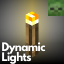

<h1 align="center">
   
  Tschipcraft's Dynamic Lights
</h1>

  
  
  
  

> Server-side dynamic lighting for Minecraft 1.17-1.21x

## Features

This data pack/mod brings dynamic lighting to Minecraft without any client-side requirements. Supported entities and items (like torches, glowstone, or enchanted gear), held or worn by players, mobs, or placed in item frames, will emit light using the [light block](https://minecraft.wiki/w/Light_(block)) added in Snapshot 21w13a. Because of this, the dynamic lights are limited to the block grid. (see [#9](https://github.com/Tschipcraft/dynamiclights/issues/9) for more information)

* [**50+ supported vanilla items**](https://github.com/Tschipcraft/dynamiclights/wiki/Supported-Items) out of the box
* **Multiple light levels**: 3, 6, 9, 12, and 15
* **Water-sensitive behavior** for some items
* **Enchanted items** glow by default (light level 6), with special cases for Fire Aspect, Riptide, Channeling (light level 9)
* **Amethyst-trimmed armor** emits light
* **Mobs, falling blocks, and display entities** can emit light if carrying a supported item
* **Curios API support** for modded inventory slots

Since this project is completely server-side, players joining a server with Dynamic Lights installed will not need to install anything on their end for it to work! However, you can still use the mod version on the client for single-player worlds only. Joining a server that does not have Dynamic Lights installed will have no effect.

[➜ For a complete list of supported items & entities, and available settings, take a look at the wiki](https://github.com/Tschipcraft/dynamiclights/wiki)

## Installation

[Download the latest release](https://github.com/Tschipcraft/dynamiclights/releases/latest) and install either as:

* **Data Pack** ➜ Place `.zip` in your world's `datapacks` folder
* **Mod** ➜ Drop into your `mods` folder and optionally install [MidnightLib](https://modrinth.com/project/codAaoxh) for a global config file and UI

To manage settings, reset, or uninstall the pack, use `/trigger tschipcraft.menu` or `/function #tschipcraft:menu`.

Also available on Modrinth and CurseForge!

<a href="https://modrinth.com/datapack/dynamic-lights">
<picture>
  <source height="72px" media="(prefers-color-scheme: dark)" srcset="https://raw.githubusercontent.com/Tschipcraft/badges/main/assets/modrinth-badge-dark.svg">
  <source height="72px" media="(prefers-color-scheme: light)" srcset="https://raw.githubusercontent.com/Tschipcraft/badges/main/assets/modrinth-badge-light.svg">
  
</picture>
</a>
<a href="https://www.curseforge.com/minecraft/data-packs/tschipcrafts-dynamic-lights">
<picture>
  <source height="72px" media="(prefers-color-scheme: dark)" srcset="https://raw.githubusercontent.com/Tschipcraft/badges/main/assets/curseforge-badge-dark.svg">
  <source height="72px" media="(prefers-color-scheme: light)" srcset="https://raw.githubusercontent.com/Tschipcraft/badges/main/assets/curseforge-badge-light.svg">
  
</picture>
</a>

## Development Builds

Development builds are available on [GitHub Actions](https://github.com/Tschipcraft/dynamiclights/actions/workflows/ci.yml). These builds are not guaranteed to be stable and may contain bugs. Please always back up your world before using them.

## Compatibility

This data pack implements the [Smithed](https://wiki.smithed.dev/conventions/) and essential [MC Datapacks Discord Server](https://mc-datapacks.github.io/en/conventions/index.html) Conventions to ensure data pack compatibility.

Light blocks used for dynamic lighting may conflict with **piston mechanics** in some redstone contraptions. Please [report issues](https://github.com/Tschipcraft/dynamiclights/issues) if you find any.
